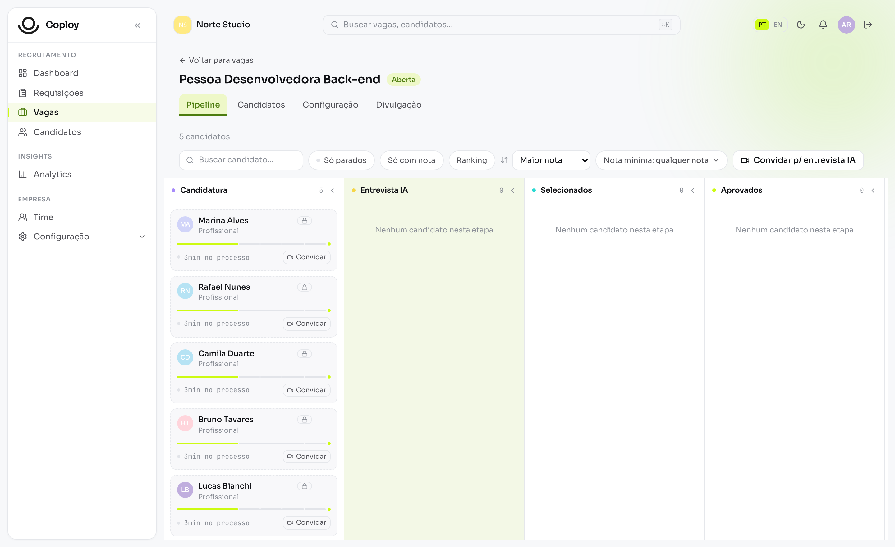
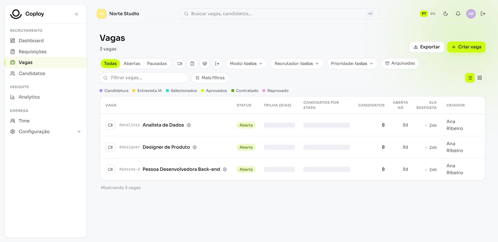
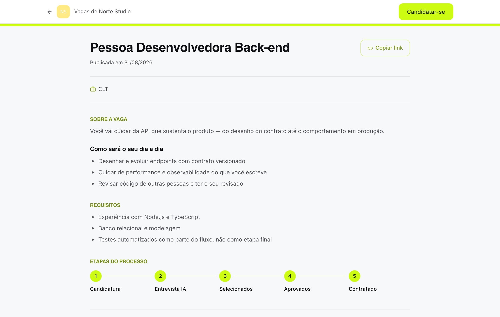

<div align="center">

# Coploy ATS

**O ATS completo na sua infraestrutura, com os seus dados.**

Vagas, pipeline, candidatos, portal público de vagas, time, e-mails e
permissões. Sobe com um `docker compose up`.

[](LICENSE)
[](https://github.com/Coploy-Team/ATS-AI/releases)
[](apps/core/openapi.public.json)
[](https://github.com/Coploy-Team/ots)

[Começar](#comece-em-três-minutos) · [Primeiro uso](#roteiro-do-primeiro-uso) ·
[Motor de entrevista](#o-motor-de-entrevista-é-plugin) ·
[Contribuir](CONTRIBUTING.md) · [Releases](https://github.com/Coploy-Team/ATS-AI/releases)

</div>

<br>



<br>

## Por que existe

Ele roda na sua infraestrutura: o banco é seu, o portal de vagas leva a sua
marca, e a sua base de candidatos fica onde você puder consultá-la, exportá-la
e levá-la embora.

É o mesmo ATS que a Coploy roda como serviço — não uma versão reduzida para
dar de graça. O que fica de fora é o **Motor** de entrevista com IA, que é
proprietário e [pluga por um padrão aberto](#o-motor-de-entrevista-é-plugin).

## Comece em três minutos

Precisa de Docker Compose v2 e ~4 GB de RAM livres.

```bash
git clone https://github.com/Coploy-Team/ATS-AI.git
cd ATS-AI
cp .env.open.example .env.open
```

Abra o `.env.open` e gere os segredos (`openssl rand -hex 32` em cada campo que
pede). Depois:

```bash
docker compose -f docker-compose.open.yml --env-file .env.open up -d --build
```

Sobe Postgres, Redis, RabbitMQ, MinIO, a API, o ATS e o portal de vagas. O
banco migra sozinho no primeiro boot.

| | |
|---|---|
| ATS | http://localhost:8080 |
| Portal de vagas | http://localhost:8081 |
| API | http://localhost:3333 |

## Roteiro do primeiro uso

Do zero até um candidato no pipeline. Vale seguir na ordem — o passo 2 é o que
mais pega gente de surpresa.

**1. Crie a conta da empresa.** Abra o ATS e use *Criar conta grátis*. A
primeira conta é a dona da empresa.

**2. Configure o envio de e-mail.** Em *Configuração → Servidor*, preencha o
SMTP. **Sem isso nenhum e-mail sai** — nem convite de colaborador, nem retorno
ao candidato, nem redefinição de senha. É o passo que mais trava instalação
nova.

**3. Crie e publique uma vaga.** Em *Vagas → Nova vaga*. Descrição, requisitos
e benefícios aceitam Markdown, e há um modelo pronto por campo se você não
quiser começar do branco. Marque a vaga como pública para ela aparecer no
portal.

**4. Candidate-se você mesmo.** Abra o portal de vagas, escolha a vaga e
preencha como se fosse candidato. A candidatura cai no pipeline na hora.

**5. Mexa no pipeline.** Arraste o card entre etapas. Reprovar exige motivo
tipado e dispara o retorno ao candidato — o anti-ghosting é do produto, não um
adendo.

**6. Vista o portal com a sua marca.** Em *Configuração → Portal de vagas*:
banner, logo, cor, descrição da empresa e links sociais.

## O que vem na caixa

**Lista de vagas** com filtros por status, modo, recrutador e prioridade, e a
distribuição de candidatos por etapa em cada linha.



**Pipeline kanban** com régua de etapas configurável por vaga, ações
automáticas por etapa e motivos tipados de reprovação.

**Portal público de vagas** com a marca da empresa — banner com recorte
arrastável, logo, cor, vídeo e links sociais. O candidato se candidata ali e
cai direto no pipeline.



**Página de vaga rica.** Descrição, requisitos, responsabilidades e benefícios
em Markdown, faixa salarial, etapas do processo e vídeo da empresa.

**Anti-ghosting de verdade.** Confirmação de candidatura, prazo de resposta por
etapa com alerta quando estoura, e retorno ao candidato com o motivo — não um
"seguiremos com outros perfis".

**Filtro de candidatura (knockout)** determinístico, avaliado no servidor.

**Hierarquia de acesso.** Dono, administrador, recrutador e leitor. O
recrutador enxerga **apenas as vagas que criou** — o recorte é aplicado nos
serviços, não escondendo botão. Vaga fora do alcance responde 404, nunca 403:
um 403 confirmaria que a vaga existe, que é exatamente o que uma vaga sigilosa
não pode entregar.

**E-mails transacionais editáveis** com a marca da sua empresa, prévia do
e-mail real (não uma imitação em CSS).

**Ainda:** importação de candidatos por CSV, requisição de vaga com aprovação,
estrutura organizacional, campos próprios na vaga, e API pública versionada
(`apps/core/openapi.public.json`, 236 operações).

## O Motor de entrevista é plugin

A entrevista conduzida por IA — vídeo, voz e WhatsApp, com avaliação por
competências e análise de autenticidade — **não está neste repositório**. É
proprietária e licenciada à parte.

Duas coisas importam aqui:

**O ATS não fica quebrado sem ela.** As telas de entrevista viram convite ao
plugin, nunca botão morto. Todo o resto funciona inteiro.

**A interface é aberta.** O contrato de entrada e saída de um motor está em
[`packages/ots-contract`](packages/ots-contract) e qualquer motor pode se
plugar — o da Coploy é o primeiro certificado contra ele, não o único
possível. Se você quiser escrever o seu, a suíte de conformidade certifica a
saída:

```bash
npx tsx packages/ots-conformance/src/cli.ts webhook resultado.json
```

Para ligar o Motor da Coploy, é uma licença e um comando; a tela
*Configuração → Servidor → Plugin* mostra o passo a passo depois que a chave é
ativada.

## OTS — o padrão aberto

Esta instalação **emite e verifica** prova de entrevista pelo
[OTS](https://github.com/Coploy-Team/ots), um padrão aberto de portabilidade
em talento.

Na prática: o candidato que fez uma entrevista aqui leva a prova dela embora, e
você aceita a prova de quem chega de outro lugar. A verificação é **offline**,
contra a chave pública de quem emitiu — sem autoridade central, sem depender da
Coploy.

## Configuração

Tudo vive no `.env.open`. Os que você provavelmente vai querer mexer:

| Variável | Para que serve |
|---|---|
| `POSTGRES_PASSWORD`, `BETTERAUTH_SECRET`, `CORE_API_KEY` | segredos da instalação — gere com `openssl rand -hex 32` |
| `PUBLIC_BASE_URL` | endereço público da instalação; entra nos links dos e-mails |
| `CAREERS_PUBLIC_URL` | endereço do portal de vagas; sem ele o convite ao candidato não tem para onde apontar |
| `EMAIL_LOGO_URL` | logo no topo dos e-mails. Vazio = e-mail sem logo |
| `OTS_SIGNING_KEY` | liga a emissão de prova OTS (`openssl genpkey -algorithm ed25519`). Vazio = só verificação |
| `MOTOR_LICENSE_SERVER_URL` | servidor de licença do Motor. Vazio = o da Coploy |

## Atualizar

```bash
git pull
docker compose -f docker-compose.open.yml --env-file .env.open up -d --build
```

As migrations rodam no boot. Vale ler as
[notas da release](https://github.com/Coploy-Team/ATS-AI/releases) antes de
subir uma versão que pula várias.

## Deu problema?

| Sintoma | Quase sempre é |
|---|---|
| Nenhum e-mail chega | SMTP não configurado em *Configuração → Servidor* |
| Convite ao candidato sem link | falta `CAREERS_PUBLIC_URL` |
| Um serviço não fica *healthy* | `docker compose -f docker-compose.open.yml logs <serviço>` |
| Portas ocupadas | um `docker-compose.override.yml` **soma** portas em vez de substituir; use `!override` |
| Tela de entrevista pede plugin | é o comportamento certo sem o Motor |

Não achou? [Abra uma issue](https://github.com/Coploy-Team/ATS-AI/issues) com
a saída do `docker compose ps` e os logs do serviço.

## Stack

TypeScript de ponta a ponta. **API**: Fastify + Zod, com o contrato público
gerado do código. **Telas**: React + Vite + Tailwind. **Dados**: Postgres via
Drizzle, Redis, RabbitMQ, MinIO. **Monorepo**: Turborepo.

A camada de dados é abstraída (`packages/infra`): o código de negócio fala com
uma interface, não com o banco. Esta distribuição roda em Postgres.

## Contribuir

Issues e pull requests são bem-vindos — veja o [CONTRIBUTING](CONTRIBUTING.md).

Este repositório é um **espelho** de um monorepo interno, então o histórico é
publicado como um commit por sincronização. Isso não muda nada para quem
contribui: PRs são revisados aqui e integrados na fonte.

## Segurança

Achou algo? **Não abra issue pública.** Escreva para
`suporte@coploy.io` e a gente responde.

## Licença

[AGPL-3.0](LICENSE). Use, modifique, rode onde quiser. Se você oferecer este
software como serviço para terceiros, as suas modificações também são abertas —
é o que mantém o combinado de pé nos dois lados.
